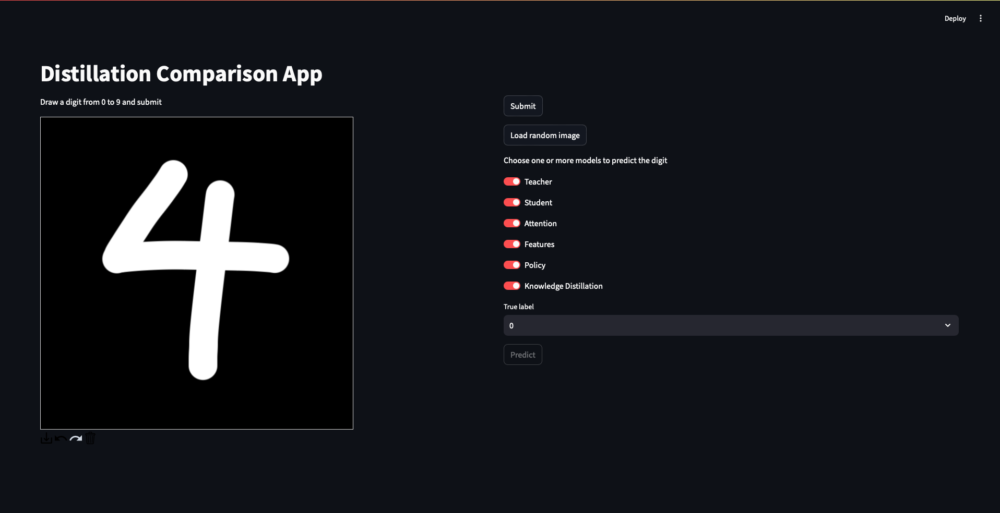
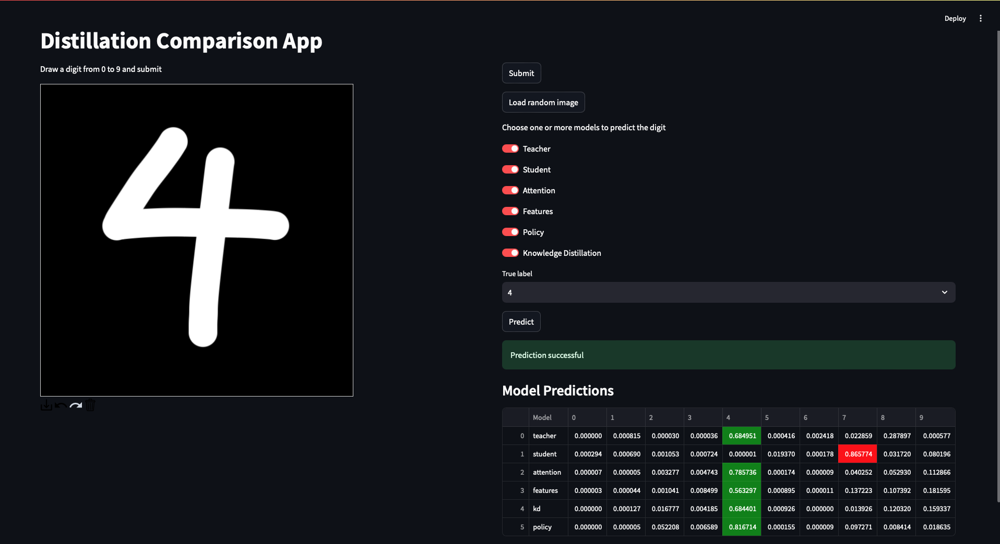

# CV Project

This project implements a small computer vision application for MNIST digit classification using **distilled student models**. The model is trained to recognize handwritten digits and deployed as a web application using **FastAPI** and **Streamlit**.

## App 

## App with Inference output
